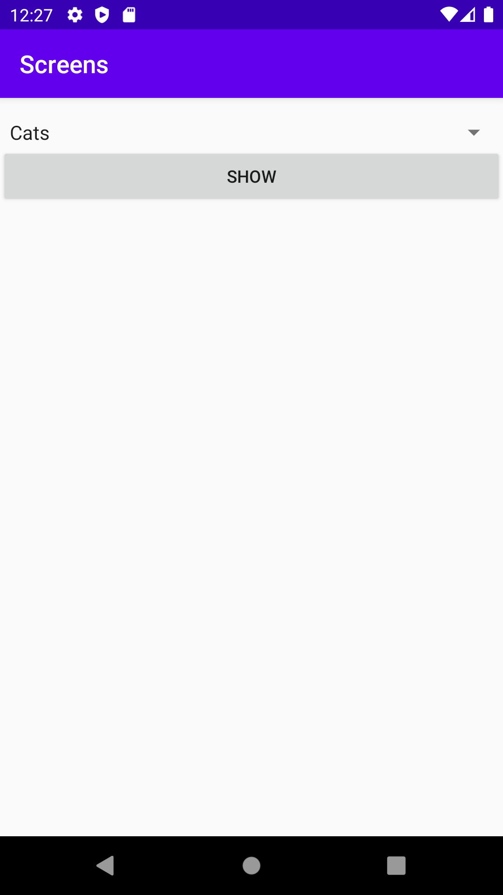
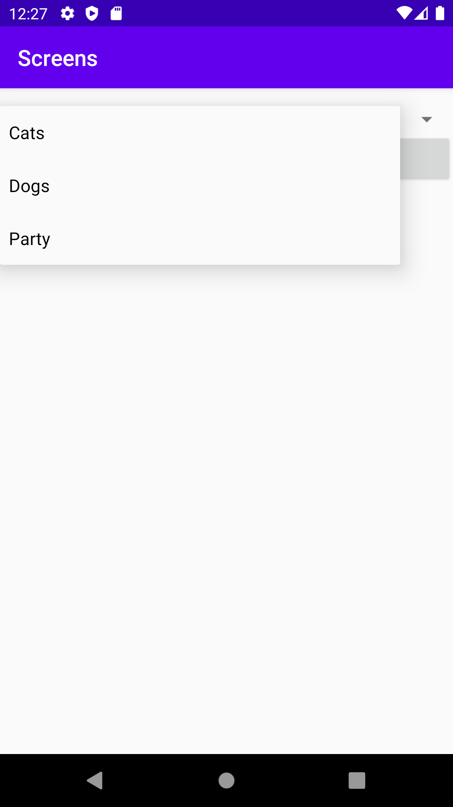
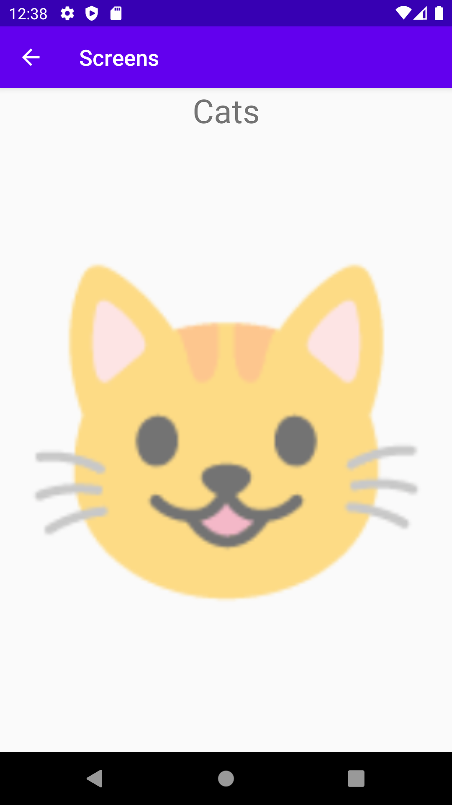

# Rapport

Applikationen använder utöver `MainActivity` en activity som kallas `SecondActivity`. Views för både `MainActivity` och `SecondActivity` lades till genom att redigera `activity_main.xml` och `activity_second.xml`. `MainActivity` innehåller en `Spinner` med tre olika kategorier(alternativ) och en `Button`. För att kunna visa `SecondActivity` så implementerades en `onClickListener` och `onClick` metod för knappen i `MainActivity`. Knappen startar `SecondActivity` och den valda kategorin skickas med intents. I kodstycket nedan visas metoden.

```java
Button showButton = findViewById(R.id.showButton);
showButton.setOnClickListener(new View.OnClickListener() {
    @Override    
    public void onClick(View view) {
        Intent intent = new Intent(MainActivity.this, SecondActivity.class);
        Spinner categorySpinner = findViewById(R.id.categorySpinner);
        String category = categorySpinner.getSelectedItem().toString(); // selected category
        intent.putExtra("category", category);
        startActivity(intent);
    }
});
```

`SecondActivity` använder en `TextView` som presenterar den valda kategorin. Nedan visas kod som används för att hantera data som skickats med intents och för att bestämma texten för widget:en.

```java
String selectedCategory = "";
flipper = findViewById(R.id.flipper);

// handle bundled data
Bundle extras = getIntent().getExtras();
if (extras != null) {
    selectedCategory = extras.getString("category");
}

TextView header = findViewById(R.id.headerText);
header.setText(selectedCategory);
```

En `ViewFlipper` används för att bläddra igenom tre olika `TextView` widgets i `SecondActivity` . Innehållet av dessa tre widgets baseras även på den valda kategorin från `MainActivity`. Selektion kontrollerar vilken array som ska användas från resursfilen `strings.xml`. I xml-filen implementerades tre olika arrays som kan användas av `TextView` widgets:en. Varje array innehåller olika emojis som representerar en av de tre kategorierna. I det kommande kodstycket så visas selektionen och hur respektive `TextView` tilldelas en emoji.

```java
// Select emojis based on the selected category
Resources resources = getResources();
String[] emojis = new String[flipper.getChildCount()];
if (selectedCategory.equals("Cats")) {
    emojis = resources.getStringArray(R.array.cats);
} else if (selectedCategory.equals("Dogs")) {
    emojis = resources.getStringArray(R.array.dogs);
} else if (selectedCategory.equals("Party")) {
    emojis = resources.getStringArray(R.array.party);
}

// get textViews from ViewFlipper and set emojis
TextView[] views = new TextView[flipper.getChildCount()];
for (int i = 0; i < flipper.getChildCount(); i++) {
    views[i] = (TextView) flipper.getChildAt(i);
    views[i].setText(emojis[i]);
}
```

Nedan visas bilder på hur `MainActivity` ser ut:




När en kategori är vald och användaren trycker på knappen så visas `SecondActivity` (se bild nedan).


